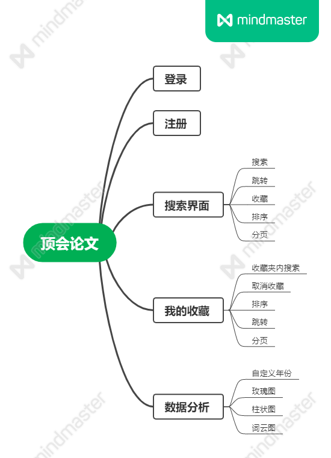

##  作业链接

[[2021春软件工程实践|S班] 结对编程作业2](https://edu.cnblogs.com/campus/fzu/FZUSESPR21/homework/11891?fileGuid=KJdDRdYyyrGk96JT)

## 结对学号

221801209 & 221801222

## 项目介绍

* 一款整合计算机视觉领域三大顶会论文的web。

* 功能结构图

  

* 后端开发：Node.js
* 数据库：Mysql
* 前端：vue.js, element-ui, axios

